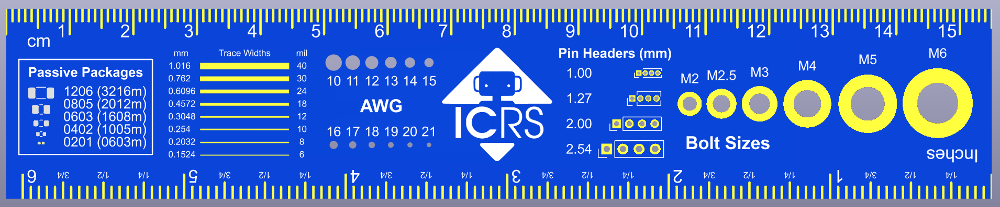
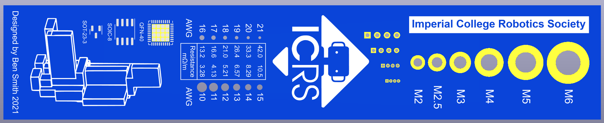

# ICRS PCB Ruler

A 15cm PCB ruler designed for Imperial College Robotics Society. It can be easily adapted/rebranded using the KiCad project in this repository.

Front:

Back:

## KiCad Project
To open this project in KiCad 7.0 clone this repository and open the .kicad_pro file in [Ruler_KiCad](Ruler_KiCad). Next open the PCB editor and go to `Preferences > Manage Footprint Libraries > Add Existing` (the folder icon below the list of libraries). Then navigate to `Ruler_KiCad/ruler_footprints` and click "select folder". This is in order to get the custom footprints used in this project.

## Ordering
The gerber files needed for ordering can be found in [Ruler_gerbers.zip](Ruler_KiCad/Ruler_gerbers/Ruler_gerbers.zip). Simply upload this .zip file to any PCB manufacturer's website.

The recommended specifications for ordering this PCB are as follows:
* 2 Layers
* 1.6mm thick FR4
* Blue soldermask
* White silkscreen
* ENIG surface finish
* <= 1 oz Copper weight
* Tented vias (doesn't matter as there are no vias)
* +- 0.2mm Board outline tolerance
* Remove order number

Using [JLCPCB's](https://jlcpcb.com/) pricing, the cost of ordering x number of boards has been plotted in [Pricing.xlsx](Pricing.xlsx).